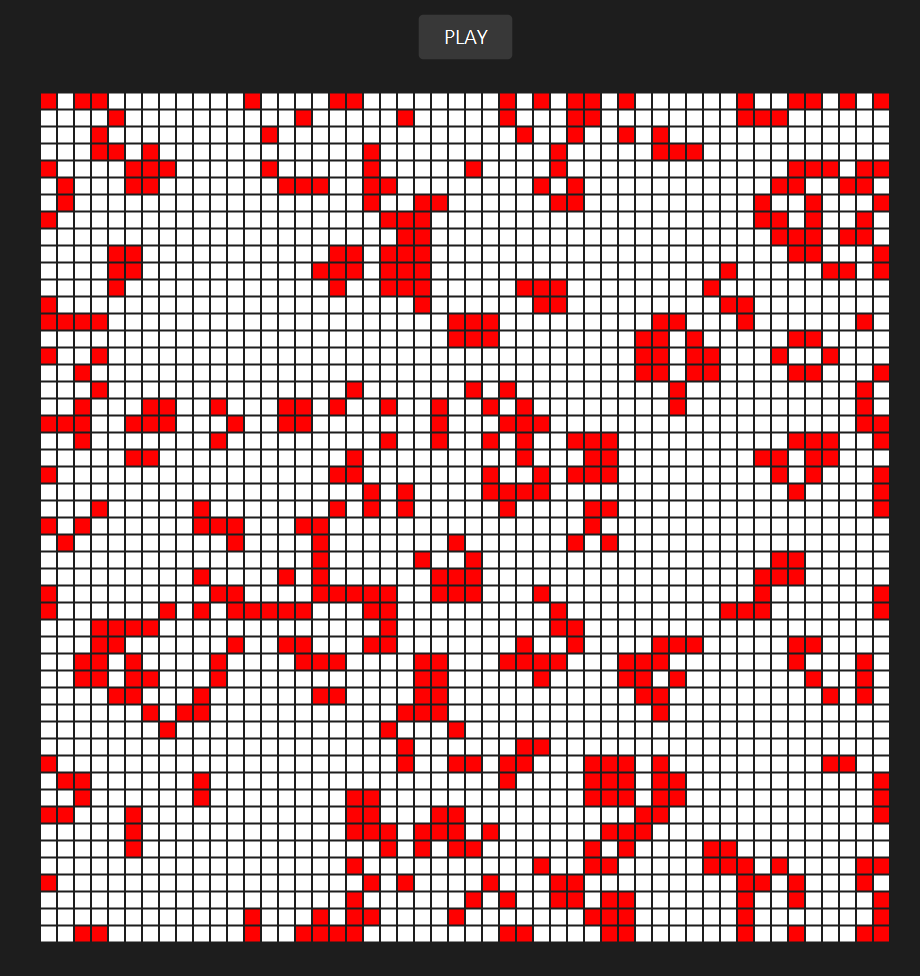

# GameOfLife
Game of life implemented in Java &amp JavaFX, following Conway's Game of life rules:
<ol>
  <li> Any alive cell with fewer than two alive neighbors dies, as if caused by under-population.</li>
  <li> Any alive cell with two or three alive neighbors lives on to the next generation.</li>
  <li> Any alive cell with more than three alive neighbors dies, as if by overcrowding.</li>
  <li> Any dead cell with exactly three alive neighbors becomes an alive cell, as if by reproduction</li>
  </ol>
  Grid size is 50x50, each cell has a size of 10 pixels, white is for dead cell and red is for alive cell. Game frequency is 30 Hz, which is 30 ticks per second. Game provides basice functionalities such as pausing/playing game by either clicking space bar or the Play/Pause Button at the top of the screen. There are three possible patterns, which can be set on the game grid by clicking Enter:
  <ol>
  <li> Random Pattern (shown on the Game overview image at the end)</li>
  <li> The Queen Bee shuttle </li>
  <li> Tumbler Pattern </li>
  </ol>
  
  
  
 
 
   
